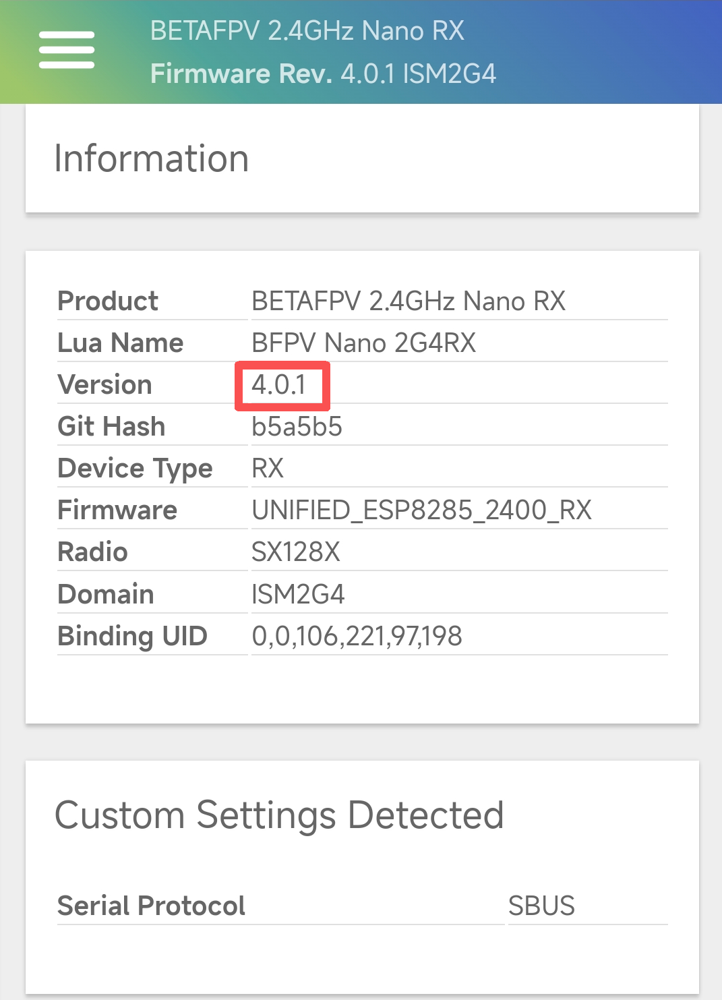
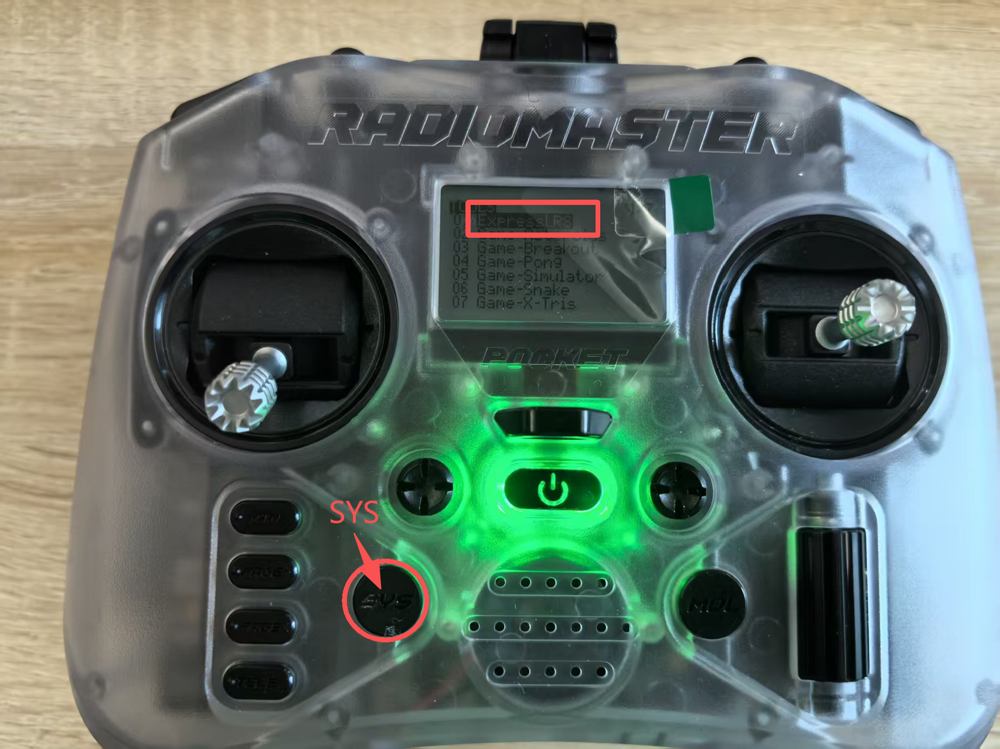
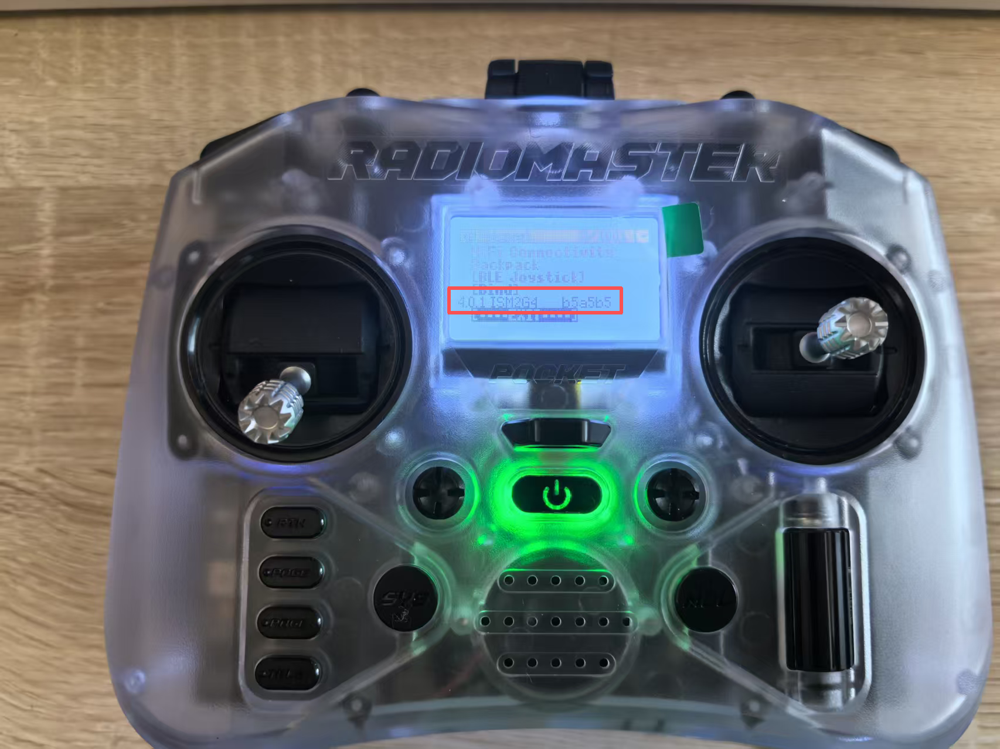
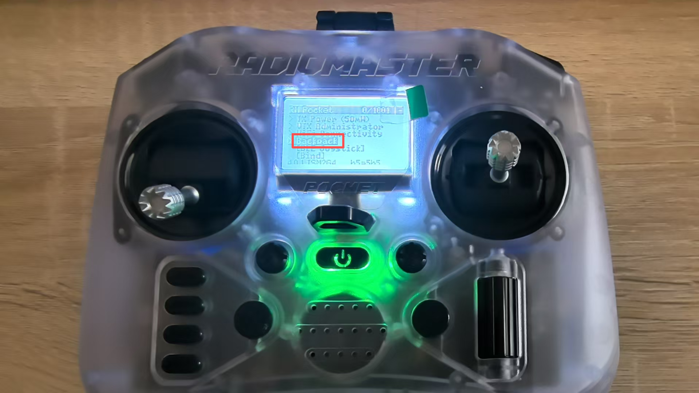
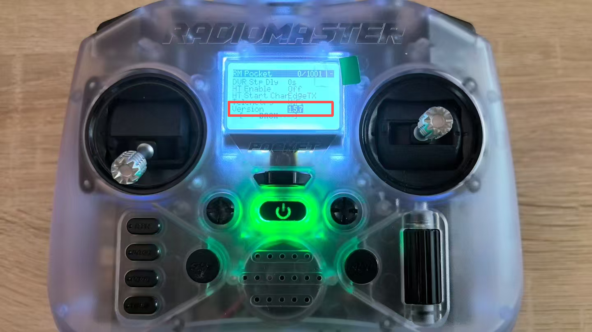
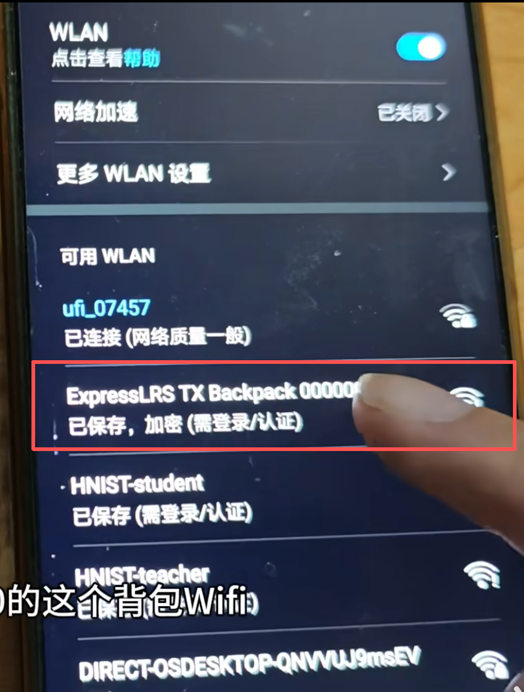
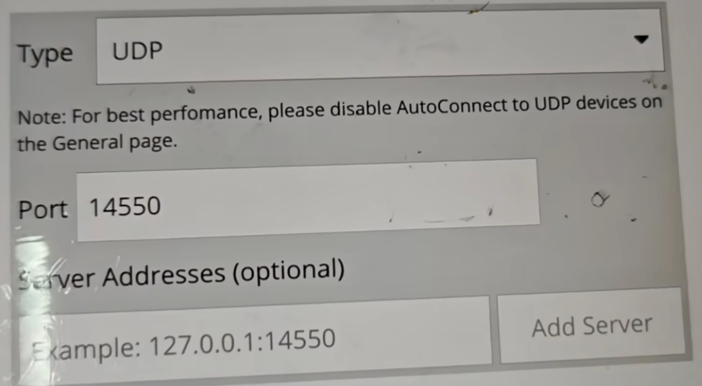

# elrs接收机mavlink到手使用

## elrs接收机版本

* 产品出厂版本为4.0.1，支持mavlink协议。

## 检查你的遥控器版本（遥控器版本需与接收机版本保持一致）

固件刷写具体请看[mavlink固件刷写](mavlink固件刷写.md)

* 以Pocket为例，点击"SYS"按键，选择进入高频头界面

**查看遥控器高频头版本**

* 拨动滚轮键至高频头界面底部，显示高频头版本信息为4.0.1(如果高频头版本与接收机版本不一致，需要升级遥控器固件)

**查看遥控器package版本**

* 高频头界面拨动滚轮键,找到“Backpack”选项，点击进入。

* 拨动滚轮至界面底部，显示package版本信息为1.5.7（建议升级到最新版本）

## 遥控器设置

* 具体配置请参考[mavlink遥控器设置](mavlink遥控器设置.md)

## 飞控配置

* 具体配置请参考[mavlink飞控配置](mavlink飞控配置.md)

## 手机连接设置

* 手机连接"package Wifi“ 选择00000结尾wifi

* 地面站”com Link"设置"UDP"，端口号14550

