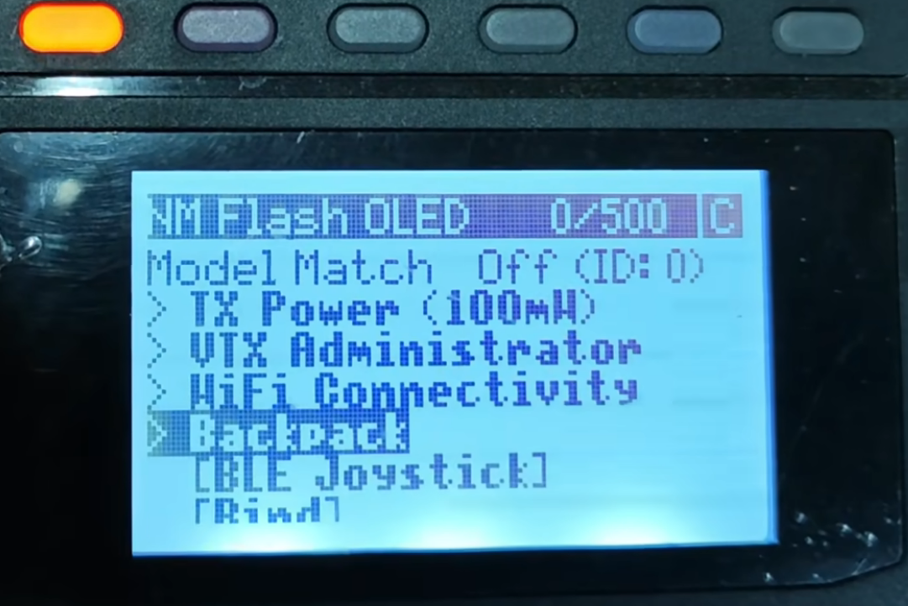
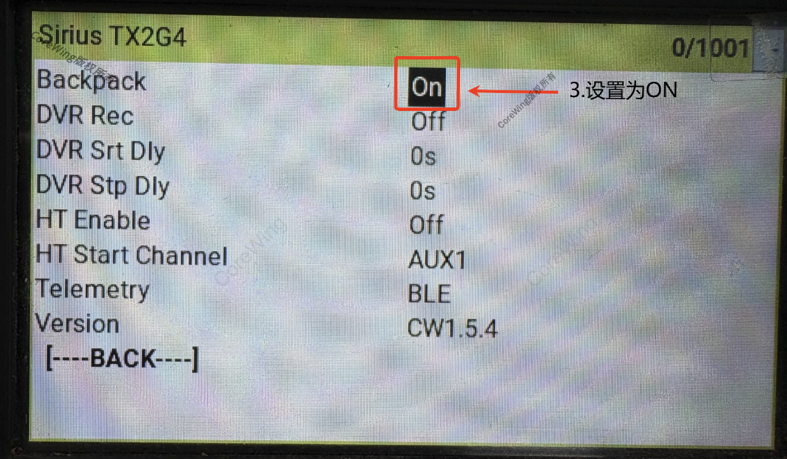
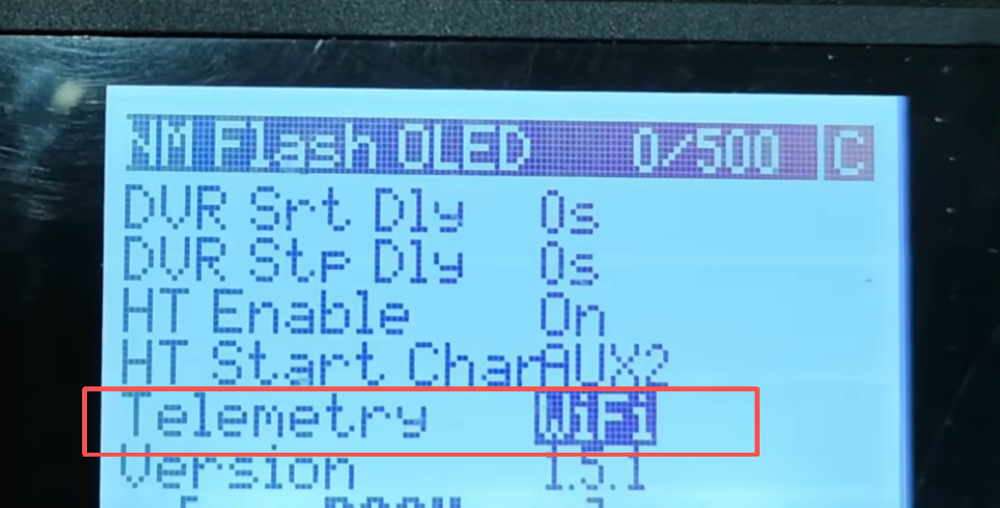
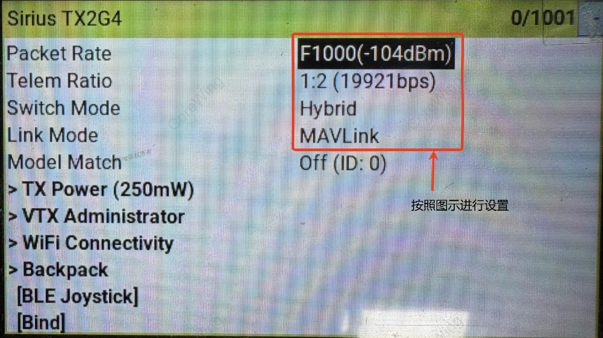
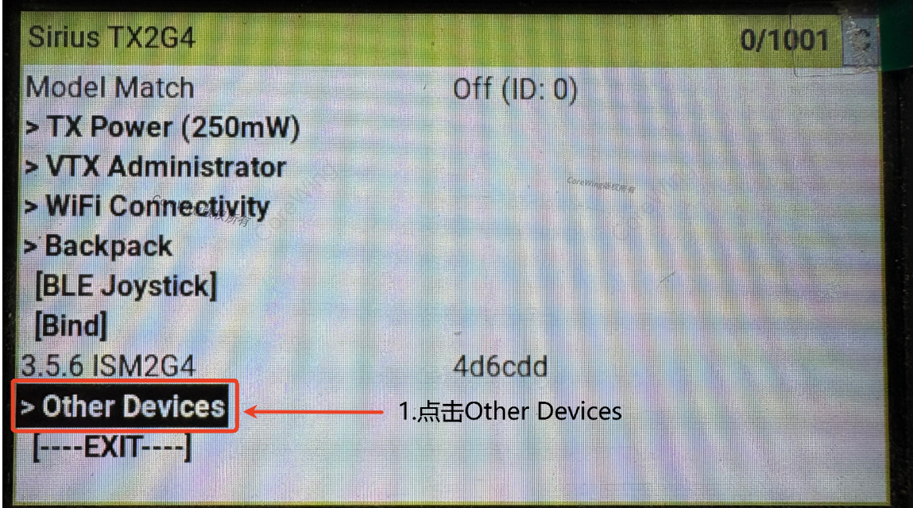
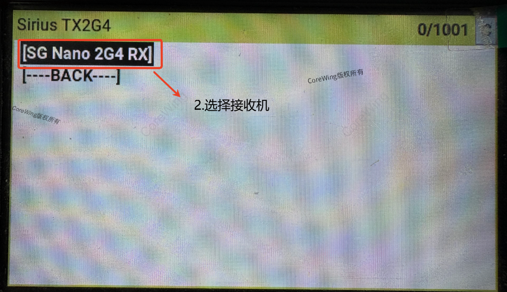
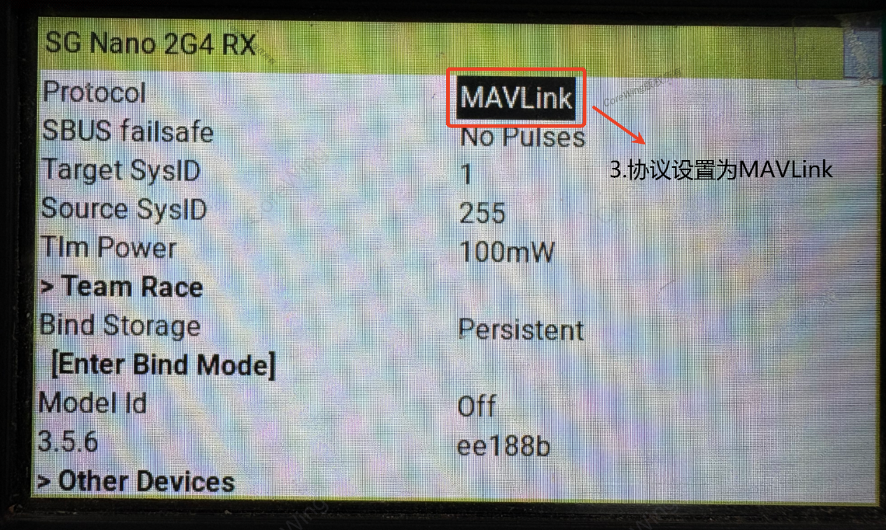

# mavlink遥控器设置
* 进入背包选项

* 打开背包功能

* 打开WiFi连接

* MAVlink 连接设置（启用MAVLink强制使用Hybrid或16ch/2交换模式。不支持宽切换模式。启用MAVLink强制遥测比例为1:2）连接接收机是无法修改设置!!!!!!!

* 将遥控器高频头固件与接收机固件升级至相同版本**对频后**,在遥控器高频头界面找到"Other Device"

* 选择对应接收机型号名称

* 更改协议至"MAVLINK"

