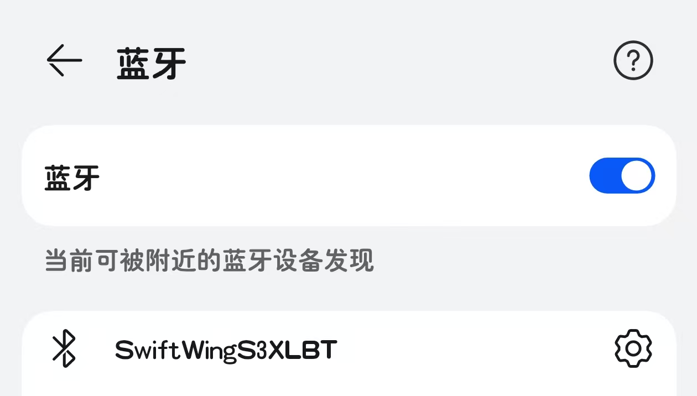
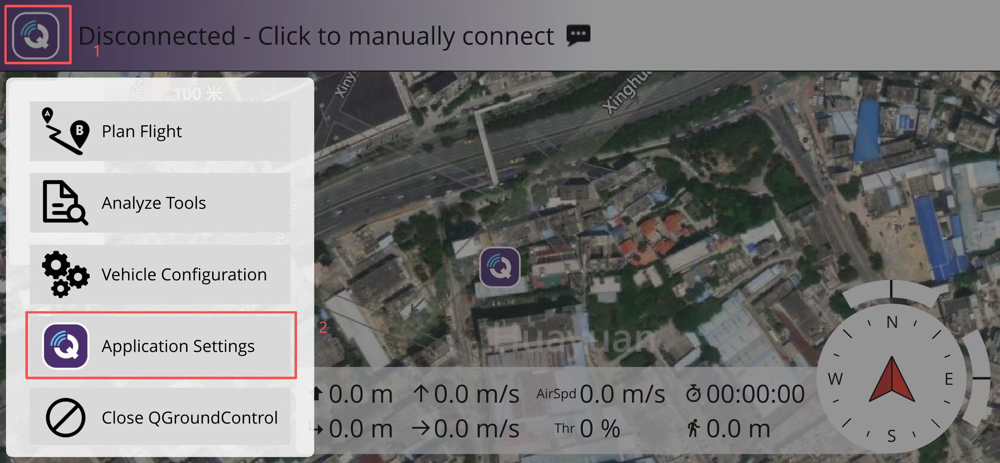
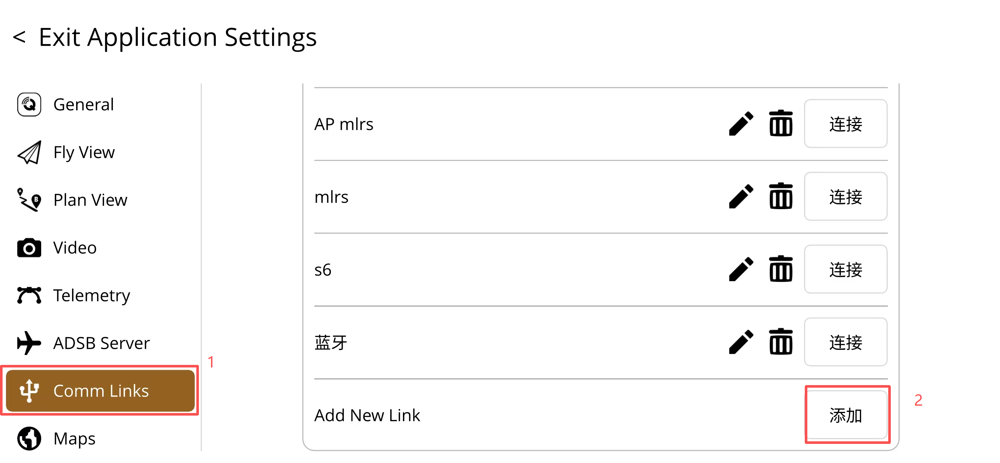
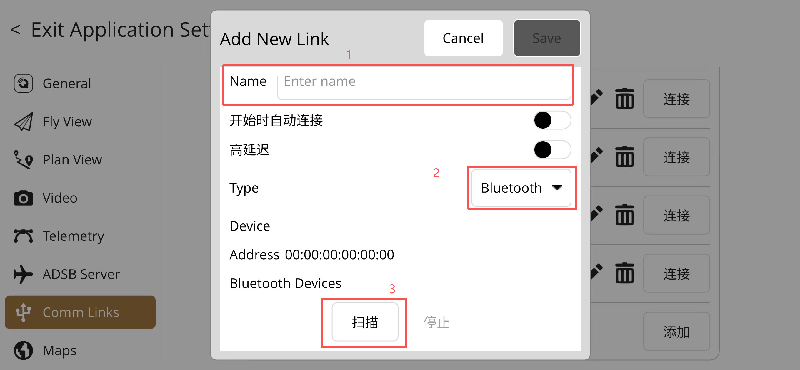
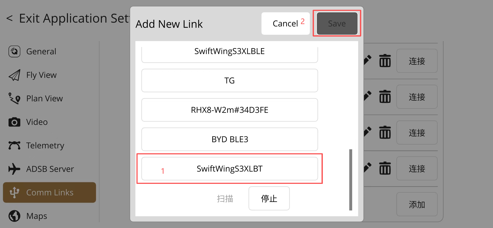

1. 首先打开手机蓝牙，搜索蓝牙设备，找到 "SwiftWingS3XLBT" 或 "SwiftWingS6XLBT"，点击连接。（若未按步骤配对，地面站可能无法连接）

2. 打开手机版QGC，点击QGC图标,选择"Application Settings"。

3. 点击”Comm Links“选项，点击”添加”按钮，添加一个新通讯连接。

4. 输入通讯连接的名称，例如”SwiftWingS3XLBT“，选择”蓝牙（Bluetooth）“作为连接类型，点击”扫描“按钮。

5. 扫描到 “SwiftWingS3XLBT” 或 “SwiftWingS6XLBT”，点击连接。

