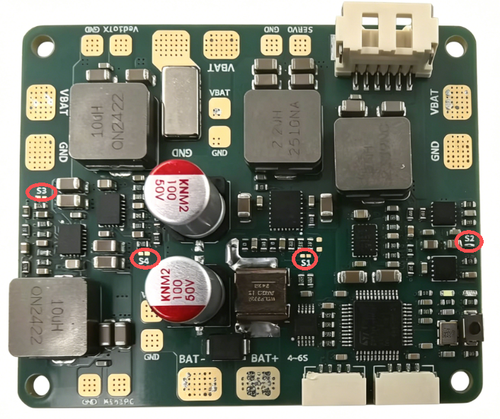
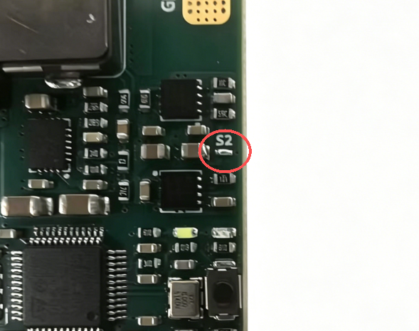
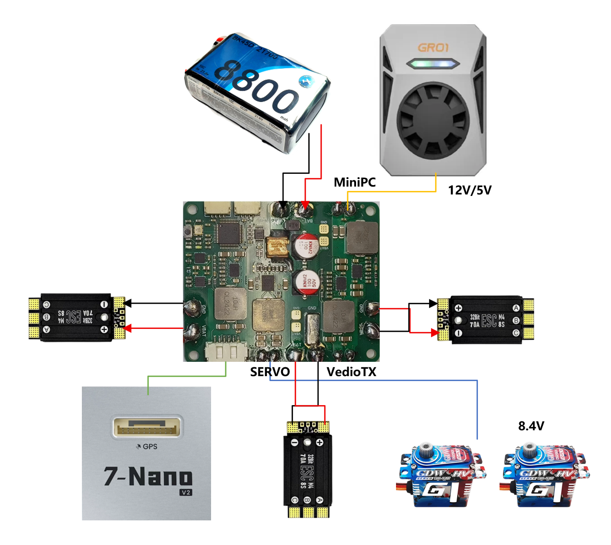
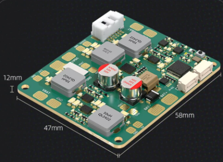
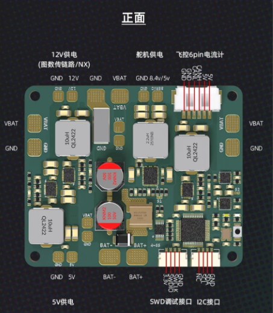

# P1无人机分电板使用说明


## 输出电压配置

根据您的设备需求，配置S1-S4焊盘：

<div style="background-color: #ffcccc; color: red; margin: 10px 0; padding: 15px;border: 1px solid #ebccd1; border-radius: 20px ;">
  <strong>注意：建议使用尖头烙铁短接焊盘</strong><br>
</div>


| 焊盘 | 功能       | 焊接  | 断开 |
| ---- | ---------- | ----- | ---- |
| S1   | 舵机电压   | 8.4V  | 5.0V |
| S2   | 协议选择   | CAN   | I2C  |
| S3   | miniPC电压 | 12.0V | 5.0V |
| S4   | 图传电压   | 12.0V | 5.0V |



### 配置示例




## 详细接线指南




## 技术参数

| 项目       | 规格                                                                                  |
| ---------- | ------------------------------------------------------------------------------------- |
| 主控芯片   | STM32L431xC，256KB Flash，运算稳定高效                                                |
| 采样芯片   | INA228AQDGSRQ1(AEC-Q100车规级)，20位超精密，精准监控电流/电压/功率/能量/充电，85V耐压 |
| 关键元件   | Vishay金属一体成形电感、车规级合金采样电阻、Murata陶瓷电容，耐用性与稳定性双保障      |
| 输入电压   | 11.1V - 25.2V (3S-6S)                                                                 |
| 最大电流   | 120A                                                                                  |
| 舵机输出   | 5V/8.4V 可选                                                                          |
| 迷你PC输出 | 5V/12V 可选                                                                           |
| 图传输出   | 5V/12V 可选                                                                           |
| 安装孔距   | M3标准孔                                                                              |
| 工作温度   | -20°C ~ 85°C                                                                        |

```

```

## 产品尺寸



## 引脚定义



## 产品灯语

* 红色:常亮CAN接口已启用，勿接IIC接口
* 白色:快速闪烁一启动中;慢速闪烁正常工作

## 安全注意事项

<div class="admonition warning">
<p class="admonition-title">注意事项</p>
<ul>
<li><strong>防短路</strong>：接线时避免工具或线材造成短路</li>
<li><strong>防反接</strong>：务必确认电源正负极正确</li>
<li><strong>防过载</strong>：不要超过120A额定电流</li>
<li><strong>防过热</strong>：大电流使用时注意散热</li>
<li><strong>防静电</strong>：焊接时使用防静电措施</li>
</ul>
</div>

## 联系支持

如有问题，请联系：

- 淘宝店铺：[SwiftWing](https://item.taobao.com/item.htm?id=975458285619)
- 技术支持：见产品包装内的联系方式
