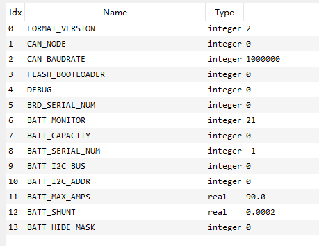
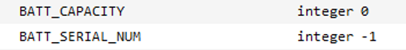
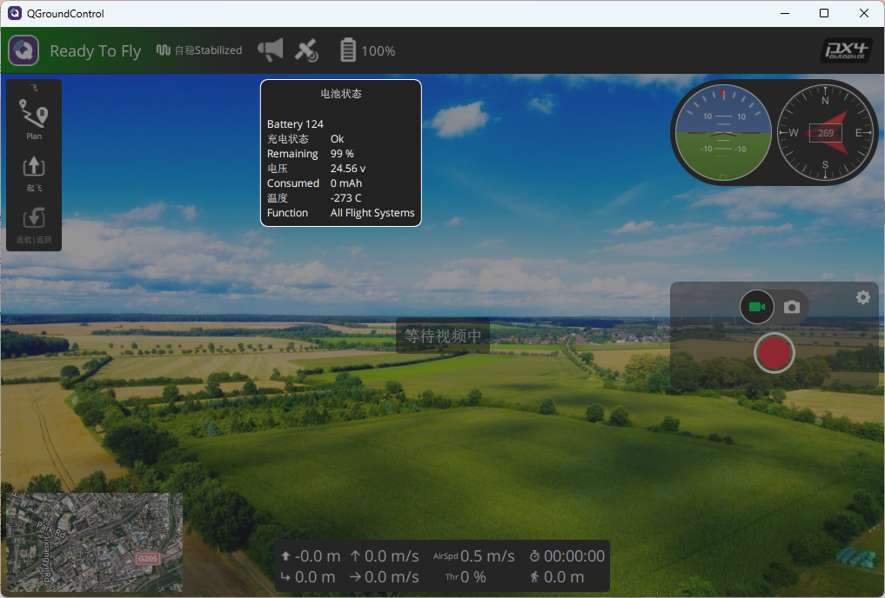
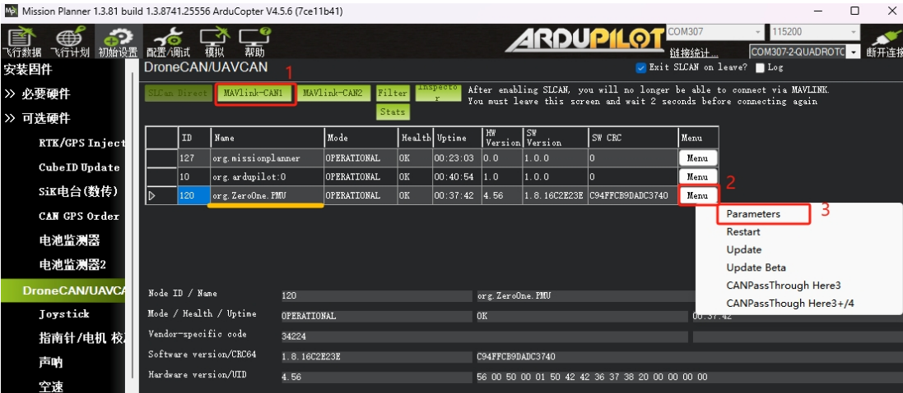
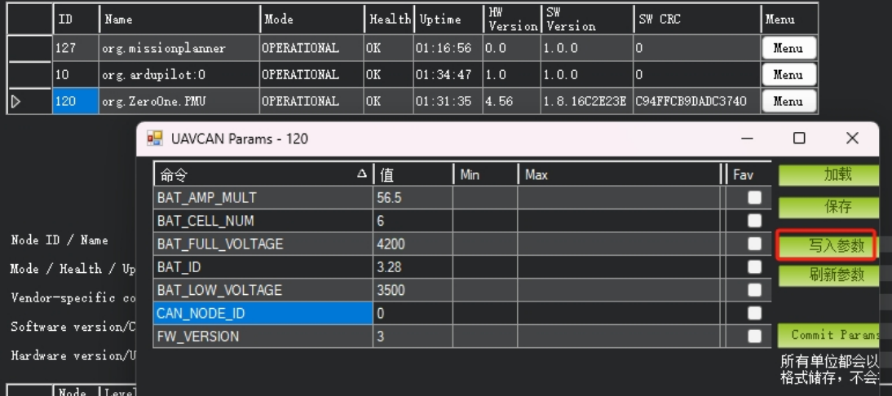

## 产品灯语

* 红色:常亮CAN接口已启用，勿接IIC接口
* 白色:快速闪烁一启动中;慢速闪烁正常工作

## 产品参数

默认参数下，地面站可直接显示出电池电压，若是没显示出电压则在地面站的 在分电板中参数表 搜索以下参数，修改参数，写入参数后重启飞控。

## PX4固件下使用方法

默认参数下，地面站可直接显示出电池电压，若是没显示出电压则在地面站的 配置/调试>>全部参数表 搜索以下参数，修改参数，写入参数后重启飞控。

1. PX4 (CAN)
UAVCAN ENBLE=SENSORS AUTOMATIC CONFIG

2. PX4 (IIC)
SENS EN_INA228=ENABLE

## ArduPilot固件下使用方法

默认参数下，地面站可直接显示出电池电压，若是没显示出电压则在地面站的 配置/调试>>全部参数表 搜索以下参数，修改参数，写入参数后重启飞控。

1. Ardupilot (CAN)
CAN_P1_DRIVER=1(接CAN总线1);
CAN_P2_DRIVER=1(接CAN总线2)
BATTx_MONITOR=8 (DroneCAN-BatteryInfo)
BATTx OPTIONS=1

2. Ardupilot (IIC)
BATT_I2C BUS=1BATT I2C ADDR=0
BATTx_MONITOR=21 (INA22X-BatteryInfo)

### 电池参数配置

电流计默认参数适合监测6S标压lipro电池，其他节数的电池需要修改参数，操作如下：

地面站显示出电池电压后，在初始设置>>可选硬件>>DroneCAN/UAVCAN界面，点击MAVLINK-CAN1，将显示出UAVCAN通信设备列表。
在列表里找到Name为org.ZeroOne.PMU，点击[menu]，再点击paramters,将显示出电流计的参数列表，可更改的参数如下：
BAT_CELL_NUM 电池节数，默认6节电芯
BAT_FULL_VOLTAGE 单节电芯满电电压，4200表示4.2V
BAT_LOW_VOLTAGE 单节电芯最低电压
CAN_NODE_ID CAN通信节点ID,默认0表示飞控给电流计自动分配id，用户可手动分配id范围在1~255.
修改参数点击写入参数，即完成配置。

