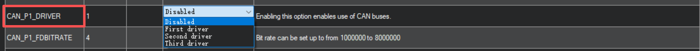
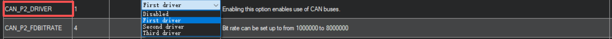
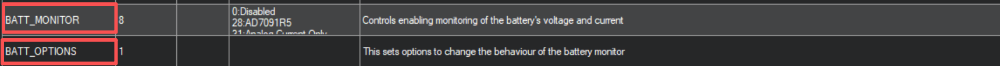
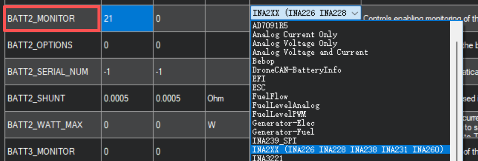
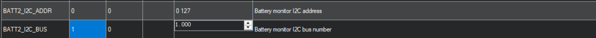
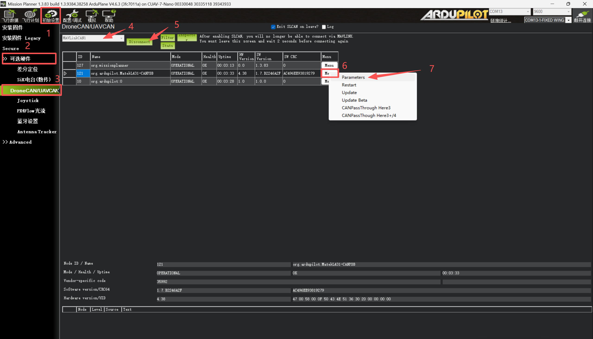
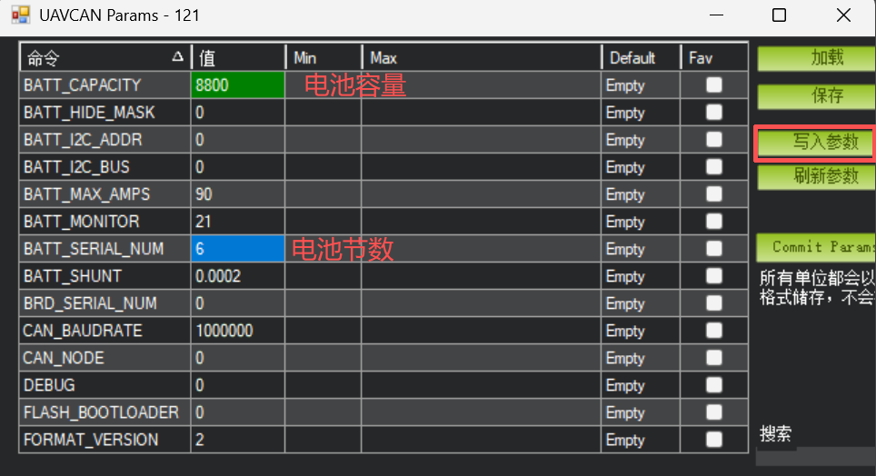

# P1分电板 配置指南（ArduPilot）
## 飞控参数配置
### 启用电压电流检测(CAN)

<div style="background-color: #ffcccc; color: red; margin: 10px 0; padding: 15px;border: 1px solid #ebccd1; border-radius: 20px ;">
  <strong>注意： 短接S2焊盘需修改</strong><br>
</div>

<div style="background-color: #ffcccc; color: red; margin: 10px 0; padding: 15px;border: 1px solid #ebccd1; border-radius: 20px ;">
  <strong>注意： 电流计仅支持经典 CAN，不支持 CAN FD 模式</strong><br>
</div>

* 启用电压电流检测需配置 P1分电板相关的控制器参数。将控制器连接至MissionPlanner地面站，在全部参数表中设置以下参数，写入后重启控制器：







```
CAN_P1_DRIVER=1 (接CAN总线1)
CAN_P2_DRIVER=1 (接CAN总线2)
BATTx_MONITOR=8 (DroneCAN-BatteryInfo)
BATTx_OPTIONS=1
```
### 启用电压电流检测(IIC)

<div style="background-color: #ffcccc; color: red; margin: 10px 0; padding: 15px;border: 1px solid #ebccd1; border-radius: 20px ;">
  <strong>注意： 未短接S2焊盘需修改</strong><br>
</div>



<div style="background-color: #ffcccc; color: red; margin: 10px 0; padding: 15px;border: 1px solid #ebccd1; border-radius: 20px ;">
  <strong>注意： 需将”BATTx_MONITOR=21“设置写入飞控后重启才可修改下面参数</strong><br>
</div>




```
BATTx_MONITOR=21 (INA22X-BatteryInfo)
BATT _I2C_BUS=1
BATT_I2C_ADDR=0
```

## 分电板参数配置
### 电池参数配置


电流计默认参数适合监测6S标压lipro电池，其他节数的电池需要修改参数，操作如下：

1. 将控制器连接至 MissionPlanner 地面站。
2. 进入配置 > 可选硬件 > Dronecan/UAVCAN 设置界面。
3. 点击“mavlink-can1”，找到设备信息栏。
4. 点击[menu]，再点击paramters,将显示出电流计的参数列表
可更改的参数如下：
```
BAT_SERIAL_NUM 电池节数
BATT_CAPACITY 电池容量，单位：mAh

```



1. 找到需修改的参数并设置，修改参数点击写入参数，即完成配置。

