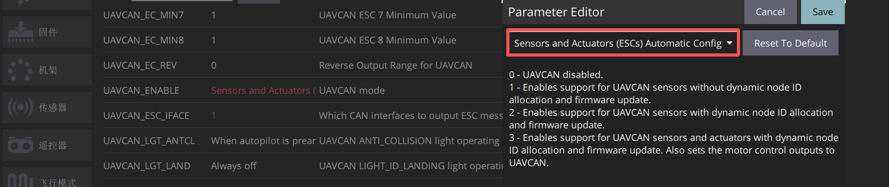
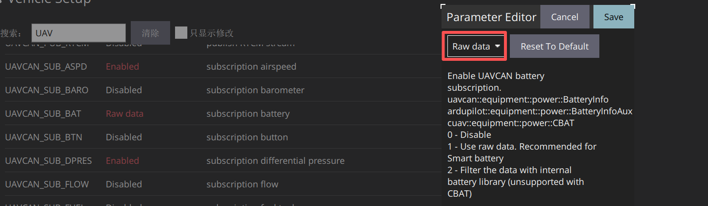
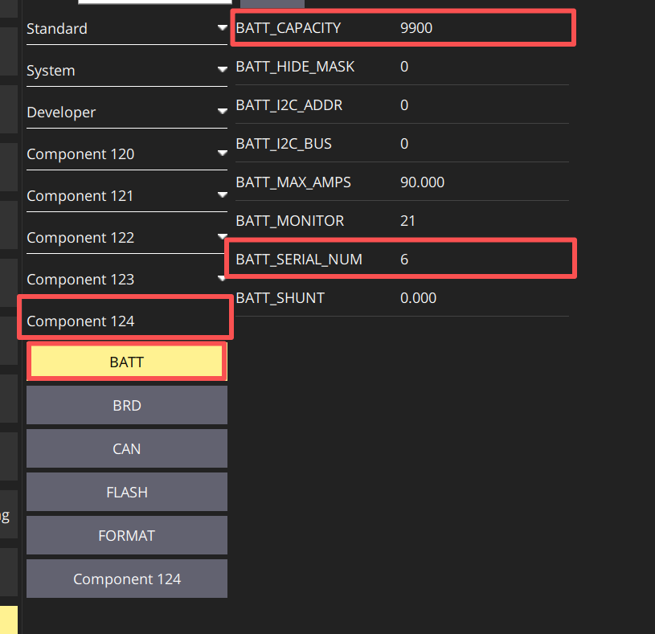

# P1分电板 配置指南（PX4）
## 飞控参数配置
### 启用电压电流检测(CAN)

<div style="background-color: #ffcccc; color: red; margin: 10px 0; padding: 15px;border: 1px solid #ebccd1; border-radius: 20px ;">
  <strong>注意： 短接S2焊盘需修改</strong><br>
</div>

* 启用电压电流检测需设置控制器参数。将控制器连接至 QGroundControl（QGC）地面站，在全部参数表中设置以下参数，写入后重启控制器：





```
UAVCAN_ENABLE 设置为“Sensor Automatic Config”（传感器自动配置）
UAVCAN_SUB_BAT 设置为“Raw data”（原始数据）
```

### 启用电压电流检测(IIC)

<div style="background-color: #ffcccc; color: red; margin: 10px 0; padding: 15px;border: 1px solid #ebccd1; border-radius: 20px ;">
  <strong>注意： 未短接S2焊盘需修改</strong><br>
</div>

* PX4官方暂不支持 如果有需求 联系飞控厂家技术编译添加INA228驱动的固件

```
SENS_EN_INA228 设置为 Enabled（启用）
```
## 分电板参数配置
### 修改电池参数（CAN）

1. 打开QGC参数配置页面
2. 下滑找到”Component+编号“选项卡，点击进入（每次飞控重启后编号会改变）
3. 修改所需参数并保存

<div style="background-color: #ffcccc; color: red; margin: 10px 0; padding: 15px;border: 1px solid #ebccd1; border-radius: 20px ;">
  <strong>注意： 每次飞控重启后编号会改变，同时在"Component"下能够找到“BATT”参数，即为CAN分电板设备参数</strong><br>    
</div>



```
BATT_CAPACITY=电池容量（单位：mAh）
BATT_SERIAL_NUM=电池节数
```
